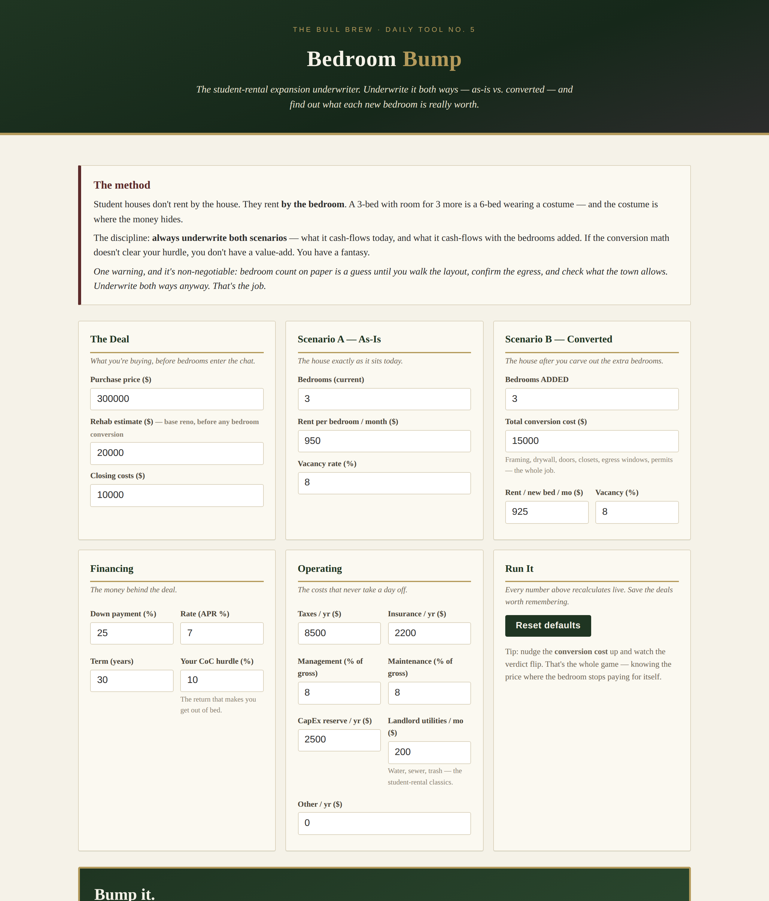

# Bedroom Bump — Student-Rental Expansion Underwriter

**Live:** https://thebullbrew.github.io/bedroom-bump/

Student houses don't rent by the house. They rent **by the bedroom**. Bedroom Bump underwrites a rental both ways — as-is vs. with bedrooms added — and tells you whether the conversion is a value-add or a fantasy.

## What it does

- **Two-scenario underwriting** — Scenario A (as-is) vs. Scenario B (converted): gross rent, vacancy, operating expenses, NOI, debt service, cash flow, cash-on-cash, cap rate, and DSCR, side by side with deltas.
- **The verdict card** — "Bump it." / "It works — slowly." / "The math says no." based on your cash-on-cash hurdle and the conversion's payback period, plus the monthly cash-flow lift and CoC swing.
- **Max conversion budget** — solves for the highest conversion cost that still clears your hurdle, total and per bedroom. Carry this number into the contractor walkthrough: above it, the new bedrooms are charity work.
- **Conversion payback** — how many months of extra rent it takes to earn the construction cost back.
- **Live recalculation** on every keystroke, bar-chart comparison, full line-item table, and a "how the math works" section with zero black boxes.
- **Saveable deals** — park properties in localStorage, reload or delete them later. Works offline as a PWA.

## The method behind it

The discipline from the buy-renovate-rent playbook: **always underwrite both scenarios**. A 3-bed with room for 3 more is a 6-bed wearing a costume — but bedroom count on paper is a guess until you walk the layout, confirm legal egress for every sleeping room, and check what the town allows. Underwrite both ways anyway. That's the job.

## Run it

No build step, no backend, no keys. Open `docs/index.html` in any browser (works from `file://`), or serve the `docs/` folder with any static host. Installable as a PWA via `manifest.webmanifest` + `sw.js`.

---

*Day 5 of The Bull Brew's daily tool series — one useful finance or real-estate tool, every day. Educational estimates only; verify every number yourself.*
